

<table>
    <theader>
        <tr>
            <td></td>
            <th>
                UNIVERSIDAD NACIONAL DE SAN AGUSTIN 
                FACULTAD DE INGENIERÍA DE PRODUCCIÓN Y SERVICIOS 
                DEPARTAMENTO ACADÉMICO DE INGENIERÍA DE SISTEMAS E INFORMÁTICA 
                ESCUELA PROFESIONAL DE INGENIERÍA DE SISTEMAS
            </th>
            <td></td>
        </tr>
    </theader>
    <tbody>
        <tr><td colspan="3">Formato: Informe de Práctica de Laboratorio</td></tr>
        <tr><td>Aprobación:  2022/03/01</td><td>Código: GUIA-PRLD-001</td><td>Página: 1</td></tr>
    </tbody>
</table>

INFORME DE LABORATORIO 

<table>
<theader>
<tr><th colspan="6">INFORMACIÓN BÁSICA</th></tr>
</theader>
<tbody>
<tr><td>ASIGNATURA:</td><td colspan="5">Programación Web 2</td></tr>
<tr><td>TÍTULO DE LA PRÁCTICA:</td><td colspan="5">Django - Relaciones, Pdf y Emails</td></tr>
<tr>
<td>NÚMERO DE PRÁCTICA:</td><td>07</td><td>AÑO LECTIVO:</td><td>2023 A</td><td>NRO. SEMESTRE:</td><td>III</td>
</tr>
<tr>
<td>FECHA INICIO::</td><td>04-Jul-2023</td><td>FECHA FIN:</td><td>14-Jul-2023</td><td>DURACIÓN:</td><td>06 horas</td>
</tr>
<tr><td colspan="6">DOCENTE:
<ul>
<li>Anibal Sardon </li>
</ul>
</td>
</<tr>
<tr><td colspan="6">INTEGRANTES:
<ul>
<li>Pedro Luis Christian Zapana Romero - pzapanar@unsa.edu.pe </li>
</ul>
</td>
</<tr>
</tdbody>
</table>

# Django - Relaciones, Pdf y Emails

## OBJETIVOS
- Manipular las relaciones entre modelos en Django.
- Poder enviar correos
- Manipular la impresión de Pdf

## TEMAS A TRATAR
- Relación de uno a muchos
- Relación muchos a muchos
- Impresión de pdfs 
- Envío de emails

## MARCO TEÓRICO
- Documentación de Django
- Un framework es una abstracción en la cual se puede reusar código y funcionalidades adaptándolos a nuestras necesidades.
- Un modelo en un framework se suele referir a los datos y su organización
- Una vista permite apreciar el resultado de la lectura de una tabla incluida en una página web.

## ACTIVIDADES
- Crear un proyecto en Django
- Siga los pasos de los videos
- Crear una aplicación que replique las actividades de los videos
  
## RESOLUCIÓN DE LA PRÁCTICA
### COMMITS
- Master: Rama con la replicación de los videos
  
  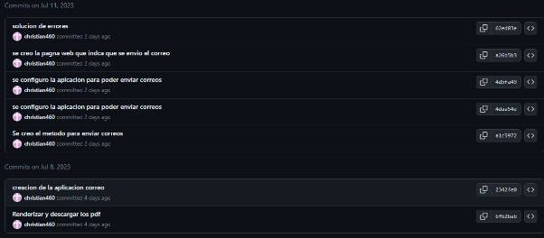
  
  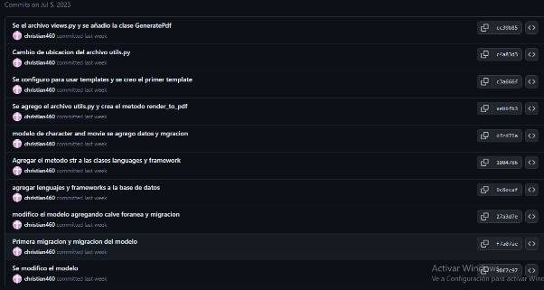
  
  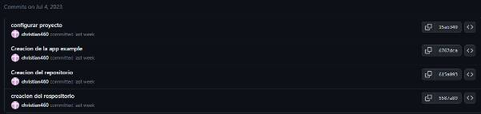
  
- Aplicación: La rama donde se desarrolló la aplicación empleando lo aprendido en los videos
  
  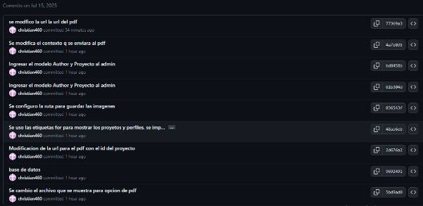

  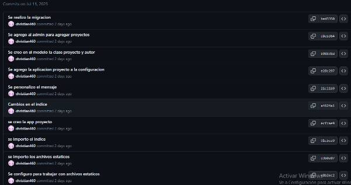

  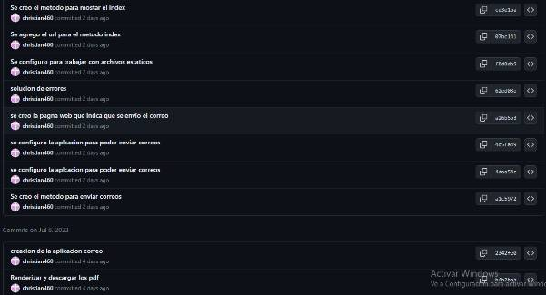

  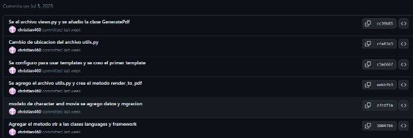

  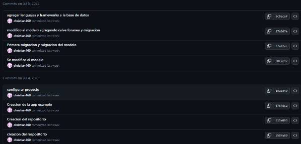
  
- Master:
- Relaciones: (models.py)
  
  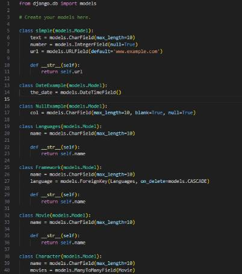
  
  El modelo consta de clases independientes como lo son simple, DateExample, NullExample y en el desarrollo de la práctica se trabajó con relaciones entre las tablas que se generan con los modelos.
  Tenemos la relación de uno a muchos la cual se puede ver entre las clases Languages y Framework ya que para un lenguaje de programación existen varios frameworks que trabajan con estos.
  También se aplicó la relación de muchos a muchos este se puede ver entre las clases Movie y Character dado que varios actores actúan en varias películas.

- Pdf: (util.py - views.py - urls.py - invoice.html)
  
  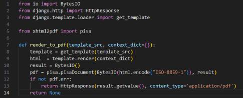

  En el archivo util.py se implemento el metodo render_to_pdf() que recibe como parámetros el html donde se encuentra el formato y contenido del pdf y como segundo parámetro lleva el contexto donde se ubican los datos que se incrustaran en el pdf. Los parámetros son guardados en las variables template y html respectivamente utilizando los métodos get_template que captura el valor del primer parámetro y template.render() que captura el contexto recibido. Luego se genera el pdf utilizando el método pisa.pisaDocument()  utilizando la plantilla html.
  De no haber ningún error se retorna un HttpResponse que contiene el pdf en caso contrario no se retorna nada.

  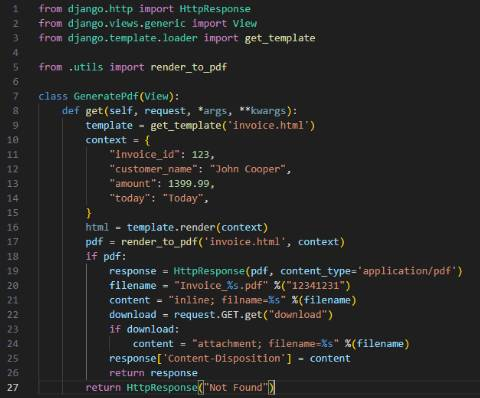
  
  Se llama a la plantilla html y se define el contexto para ser enviados al método render_to_pdf(),  si se recibe el pdf Se genera las configuraciones del pdf para ser mostrado y poder ser descargado. En caso no se reciba nada se muestra un mensaje que no fue encontrado.

  

  Se llama al método GeneratePdf que se encuentra en el archivo views.py por medio de la url.
  
  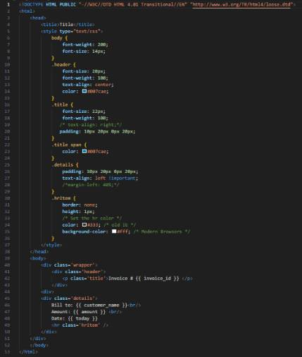

  La plantilla html con la que se generará el pdf.
  
- Correo: (views.py - enviar.html - urls.py)
  
  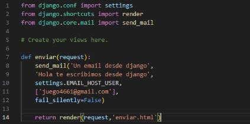

  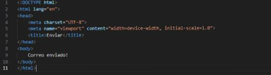
  
  Por medio del método enviar el cual utiliza el método send_mail() que recibe como parámetros el asunto, el mensaje, el remitente que se encuentra en el archivo settings.py en el cual se configuro los datos para enviar un correo, el destinatario y el atributo fail_silently que evita errores al momento de enviar el correo, en caso el correo sea enviado correctamente nos dirigirá a enviar.html  y mostrará el mensaje que el correo fue enviado con éxito.

  
  
  En el archivo urls.py se llama al método enviar que está en el archivo views.py al estar en el inicio del proyecto.
  
- Aplicación:
- Index:
  
   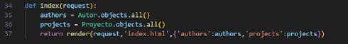

  En el método index se recolectan los datos que pertenecen a los autores y proyectos para así ser guardados en variables y enviarlos en el contexto de método render() llamando a index.html donde por medio de los tag for serán mostrados en la página web.
  
   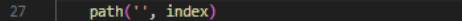

  Se llama al método index que se encuentra en el archivo views.py.

  

  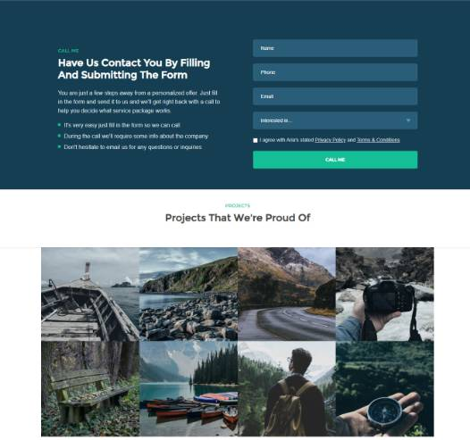

  
  
- Relaciones: (models.py)
  
  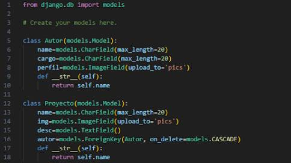
  
  En el modelo de la aplicación diseñada tenemos las clases Autor y Proyecto las cuales presentan una relación de una a muchas dado que un autor puede desarrollar múltiples proyectos.
  La clase Autor presenta los atributos name, cargo y perfil; que representan el nombre, su cargo en la empresa y su foto respectivamente. Presentan como indicador el atributo name.
  La clase Proyecto presenta los atributos name, img, desc y autor; que representan el nombre del proyecto, su imagen que se mostrará, su descripción y su autor respectivamente. Este último atributo presenta clave foránea que está relacionada con la clase Autor. En caso de ser eliminado un autor se efectúa un borrado en forma cascada.

- Pdf:(utils.py - views.py - urls.py - proyecto.html)
  
  
    
  En el archivo util.py se implemento el metodo render_to_pdf() que recibe como parámetros el html donde se encuentra el formato y contenido del pdf y como segundo parámetro lleva el contexto donde se ubican los datos que se incrustaran en el pdf. Los parámetros son guardados en las variables template y html respectivamente utilizando los métodos get_template que captura el valor del primer parámetro y template.render() que captura el contexto recibido. Luego se genera el pdf utilizando el método pisa.pisaDocument()  utilizando la plantilla html.
  De no haber ningún error se retorna un HttpResponse que contiene el pdf en caso contrario no se retorna nada.

  
  
  Se llama a la plantilla html y se define el contexto para ser enviados al método render_to_pdf(),  si se recibe el pdf Se genera las configuraciones del pdf para ser mostrado y poder ser descargado. En caso no se reciba nada se muestra un mensaje que no fue encontrado.

  
  
  En el archivo urls.py se llama al método enviar que está en el archivo views.py utilizando un url dinámico por medio del id para mostrar los datos del proyecto que fue seleccionado.
  
  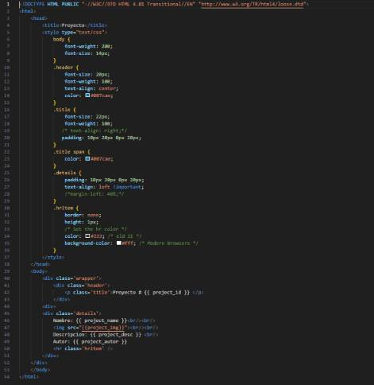

  La plantilla html con la que se generará el pdf.

   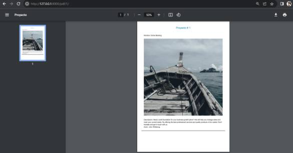

- Correo: (views.py - enviar.html - urls.py)
  
  
  
  Por medio del método enviar el cual utiliza el método send_mail() que recibe como parámetros el asunto, el mensaje, el remitente que se encuentra en el archivo settings.py en el cual se configuro los datos para enviar un correo, el destinatario y el atributo fail_silently que evita errores al momento de enviar el correo, en caso el correo sea enviado correctamente nos dirigirá a enviar.html  y mostrará el mensaje que el correo fue enviado con éxito.

  
  
  En el archivo urls.py se llama al método enviar que está en el archivo views.py al estar en el inicio del proyecto.

## REFERENCIAS
- Link del repositorio: https://github.com/christian460/lab7.git
- Link del video en Flipgrid: https://flip.com/s/VnRHgzBDhyiL

 

